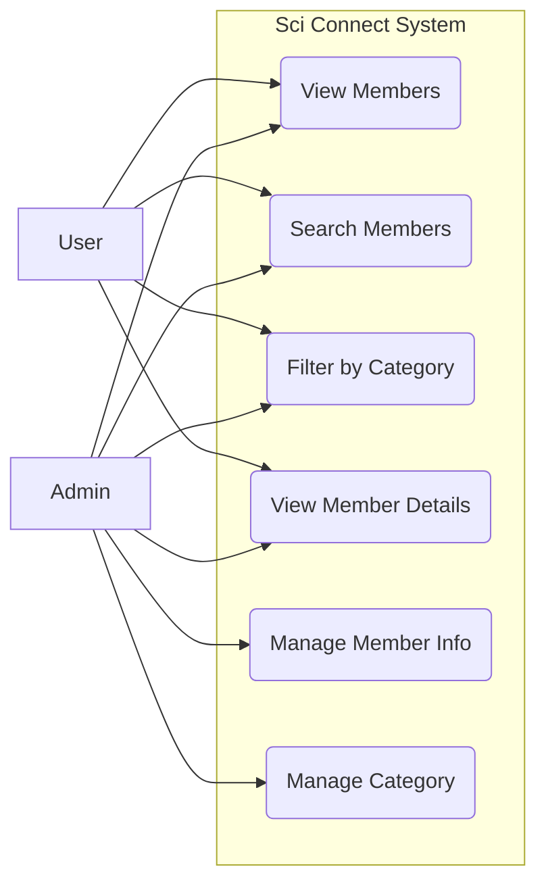

รายชื่อสมาชิก   
1.สิรภพ บุญโกสุมภ์ 67102010175  
2.พณพัฒน์ เขื่อนข่ายแก้ว 67102010522  
3.วรากร สังข์ทอง 67102010528  

#Phase 1

# sciconnect
ที่มาของปัญหาและความสำคัญ
ในปัจจุบัน นิสิตภายในคณะมีการเรียนและทำกิจกรรมแยกตามสาขาเป็นส่วนใหญ่ ทำให้นิสิตแต่ละสาขาไม่ค่อยมีโอกาสได้ทำความรู้จักหรือแลกเปลี่ยนความรู้กับนิสิตจากสาขาอื่น ส่งผลให้การสร้างความสัมพันธ์และเครือข่ายภายในคณะยังมีข้อจำกัด อีกทั้งการจัดเก็บข้อมูลรายชื่อนิสิตในรูปแบบเดิมยังขาดความเป็นระเบียบ ไม่มีแหล่งข้อมูลกลางที่รวบรวมรายชื่อนิสิตจากทุกสาขาและทุกรุ่นไว้อย่างชัดเจน  

ปัญหาดังกล่าวทำให้การค้นหาข้อมูล การติดต่อสื่อสาร และการทำความรู้จักนิสิตต่างสาขาเป็นไปได้ยาก ดังนั้นการพัฒนาระบบจัดเก็บและแสดงรายชื่อนิสิตในคณะจึงมีความสำคัญ เนื่องจากจะช่วยรวบรวมข้อมูลนิสิตไว้ในที่เดียวอย่างเป็นระบบ ทำให้นิสิตสามารถเข้าถึงข้อมูลและทำความรู้จักกันได้ง่ายขึ้น ช่วยส่งเสริมความสัมพันธ์ระหว่างนิสิตต่างสาขา และสร้างเครือข่ายภายในคณะให้เกิดความต่อเนื่องและยั่งยืน  

# จุดประสงค์ของโครงการ (แก้ปัญหาอะไร)  
1.เพื่อแก้ปัญหานิสิตแต่ละสาขาไม่ค่อยมีโอกาสได้ทำความรู้จักและติดต่อกัน  
2.เพื่อสร้างระบบที่รวบรวมข้อมูลรายชื่อนิสิตจากทุกสาขาและทุกรุ่นไว้ในที่เดียว  
3.เพื่ออำนวยความสะดวกในการค้นหาและทำความรู้จักนิสิตต่างสาขาและต่างรุ่น  
4.เพื่อส่งเสริมการสร้างความสัมพันธ์และการแลกเปลี่ยนความรู้ระหว่างนิสิตภายในคณะ  
# ประโยชน์ที่คาดว่าจะได้รับ  
1.นิสิตสามารถทำความรู้จักเพื่อนต่างสาขาได้ง่ายและมากขึ้น  
2.ช่วยสร้างเครือข่ายความสัมพันธ์ภายในคณะ และเพิ่มโอกาสในการทำกิจกรรมหรือทำงานร่วมกัน  
3.ทำให้นิสิตสามารถติดต่อหรือขอคำแนะนำจากนิสิตในสาขาอื่นได้สะดวกขึ้น  
4.คณะมีฐานข้อมูลรายชื่อนิสิตที่เป็นระเบียบและสามารถนำไปใช้งานต่อได้  
5.ระบบสามารถนำไปพัฒนาต่อยอดฟีเจอร์อื่น ๆ ในอนาคตได้  
# ขอบเขตของ project   
1.ผู้ใช้สามารถเข้าสู่ระบบโดยใช้เลขนิสิตได้  
2.ผู้ใช้สามารถเพิ่มรูปและข้อมูลของตัวเองลงไปได้  
3.ผู้ใช้สามารถดูข้อมูลที่ผู้อื่นได้  
4.ผู้ใช้สามารถแก้ไขข้อมูลของตัวเองได้ตลอดเวลา  
5.ผู้ใช้สามารถกดแสดงข้อมูลหรือกดไม่แสดงข้อมูลของตนเองได้  
6.มีการแยกสาขาและชั้นปีชัดเจน  

# Function and non-Functional requirement  
## Function Requirement  
1.ให้ User สามารถ Login/Sign Up ได้  
2.ก่อนใช้งานต้องถามความยินยอม PDPA จากผู้ใช้งาน หากไม่ยินยอม จะไม่สามารถเข้าใช้งานได้  
3.ต้องให้รูปโปรไฟล์สามารถใส่ได้มากกว่า 1 รูป  
4.ต้องการให้มีสีกรอบโปรไฟล์บ่งบอกถึงสาขาวิชาของ User นั้นๆ  
5.นิสิตที่อยู่ระหว่างการศึกษา จะมีเลขชั้นปี 1,2,3,4 อยู่ที่มุมโปรไฟล์  
6.นิสิตที่เป็นศิษย์เก่า จะมีเลขรหัส 2 ตัวหน้าที่แสดงถึงปีการศึกษา เช่น 62 63 ที่มุมโปรไฟล์  
7.นิสิตที่ลาออก/ไม่ได้อยู่ระหว่างศึกษาปัจจุบัน จะแสดงเป็น ex ที่มุมโปรไฟล์  
8.ถ้า User ทำการ Login แต่ไม่อยากเปิดเผยโปรไฟล์ ต้องการให้ขึ้นสาขาวิชาของ User นั้นๆ  
9.หน้าแรกที่เป็นหน้าแนะนำ User อื่นๆ อยากให้ขึ้นโปรไฟล์แบบ Random ไม่สนใจสาขาวิชา  
10.ในส่วนที่กรอกคำอธิบาย อยากให้มีการตรวจสอบคำที่ไม่เหมาะสม  
## non-Functional Requirement  
1.ต้องการให้ใช้งานง่าย เหมาะสำหรับคนทุกสาขาวิชา  
2.เน้นโทนสีที่มีความสวยงาม สบายตา  

# ข้อมูลเพิ่มเติม
## Function Requirement 
1.ให้ User สามารถ Login/Sign Up ได้  
2.ก่อนใช้งานต้องถามความยินยอม PDPA จากผู้ใช้งาน หากไม่ยินยอม จะไม่สามารถเข้าใช้งานได้  
4.ต้องการให้มีสีกรอบโปรไฟล์บ่งบอกถึงสาขาวิชาของ User นั้นๆ  
5.นิสิตที่อยู่ระหว่างการศึกษา จะมีเลขชั้นปี 1,2,3,4 อยู่ที่มุมโปรไฟล์  
6.นิสิตที่เป็นศิษย์เก่า จะมีเลขรหัส 2 ตัวหน้าที่แสดงถึงปีการศึกษา เช่น 62 63 ที่มุมโปรไฟล์  
8.ถ้า User ทำการ Login แต่ไม่อยากเปิดเผยโปรไฟล์ ต้องการให้ขึ้นสาขาวิชาของ User นั้นๆ  
(ตัดข้อ 3,7,9,10)
## (New) Function Requirement  
1.เพิ่มระบบ Skill Tags เพื่อให้ผู้ใช้กำหนดความถนัดเป็นคำสั้นๆ ช่วยให้ค้นหาได้ง่ายและแม่นยำขึ้น
2.เพิ่มระบบ Social Media Links ในหน้าโปรไฟล์ เพื่อให้นิสิตสามารถกดปุ่มติดต่อกันผ่าน Line หรือ IG ได้ทันที (ตามที่ได้รับ Feedback จากการสัมภาษณ์)
3.เพิ่มระบบ Filter & Search ให้สามารถค้นหาสมาชิกจาก Skill, ชั้นปี และสาขาวิชาได้

## non-Functional Requirement  
1.ต้องการให้ใช้งานง่าย เหมาะสำหรับคนทุกสาขาวิชา  
2.เน้นโทนสีที่มีความสวยงาม สบายตา 
## (New) non-Functional Requirement  
1.เพิ่ม Responsive Web Design: หน้าเว็บไซต์ต้องแสดงผลได้พอดีกับหน้าจอโทรศัพท์มือถือ

# Use case diagram

 
# อธิบายกระบวนการทำงาน โดยใช้ process, methods, and tools อย่างไร (ข้อมูลจาก phase 1)
## 1. Process  
ระบบถูกพัฒนาต่อยอดจากฟังก์ชัน Category เดิม โดยปรับเปลี่ยนวัตถุประสงค์จากการเก็บข้อมูลทั่วไป มาเป็นระบบ จัดเก็บและแสดงข้อมูลสมาชิก อย่างเป็นโครงสร้างชัดเจน ซึ่งกระบวนการทำงานหลักมีดังนี้  
กำหนด Category ให้แทน สาขา / ปีการศึกษา (รุ่น)  
ผู้ดูแลหรือสมาชิกสามารถเลือก Category ที่ต้องการ  
เพิ่มข้อมูลสมาชิกภายใน Category นั้น ๆ  
ระบบจัดเก็บข้อมูลสมาชิกอย่างเป็นระเบียบในฐานข้อมูล  
แสดงผลข้อมูลสมาชิกตามสาขาและรุ่น  
ผู้ใช้งานสามารถเข้าดู ค้นหา และทำความรู้จักสมาชิกได้อย่างสะดวก  
## 2. Methods 
ระบบใช้แนวคิดการออกแบบแบบมีโครงสร้าง เพื่อให้ข้อมูลมีความเป็นระเบียบและใช้งานได้ในระยะยาว โดยมีวิธีการดังนี้  
ใช้แนวคิด Category-based Organization  
 > ใช้ Category แทนสาขาและปีการศึกษา เพื่อแยกกลุ่มสมาชิกอย่างชัดเจน  
ออกแบบข้อมูลสมาชิกแบบ Profile-based  
 โดยข้อมูลของสมาชิกแต่ละคนประกอบด้วย  
ชื่อ–นามสกุล หรือชื่อเล่น  
รูปภาพโปรไฟล์  
ข้อมูลแนะนำตัวสั้น ๆ (ความถนัด / ความสนใจ)  
ข้อมูลการติดต่อ  
ใช้แนวคิด User-centered Design  
 เพื่อให้ผู้ใช้งานรุ่นน้องสามารถค้นหา ทำความรู้จัก และติดต่อรุ่นพี่ได้ง่าย  
## 3. Tools 
เครื่องมือพัฒนาเว็บไซต์  
HTML / CSS / JavaScript สำหรับแสดงผล  
PHP สำหรับจัดการข้อมูลฝั่งเซิร์ฟเวอร์  
ฐานข้อมูล  
phpMyAdminสำหรับจัดเก็บข้อมูล Category และข้อมูลสมาชิก  
เครื่องมือพัฒนา  
VS Code สำหรับเขียนและแก้ไขโค้ด  
XAMPP สำหรับจำลองเซิร์ฟเวอร์และฐานข้อมูล  

#Phase 2

