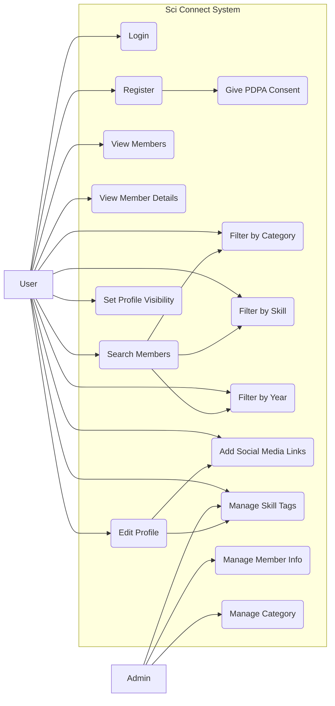
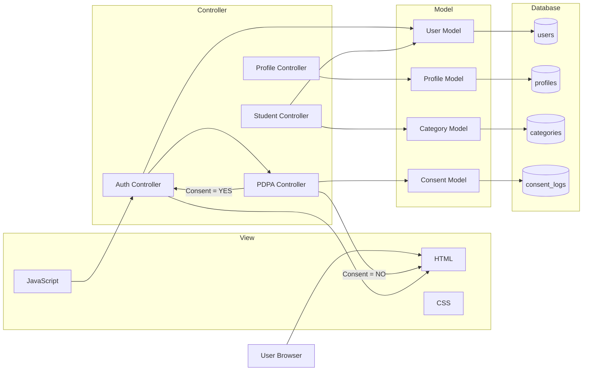
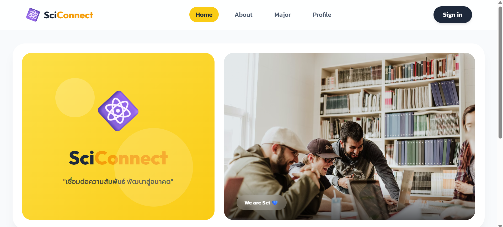
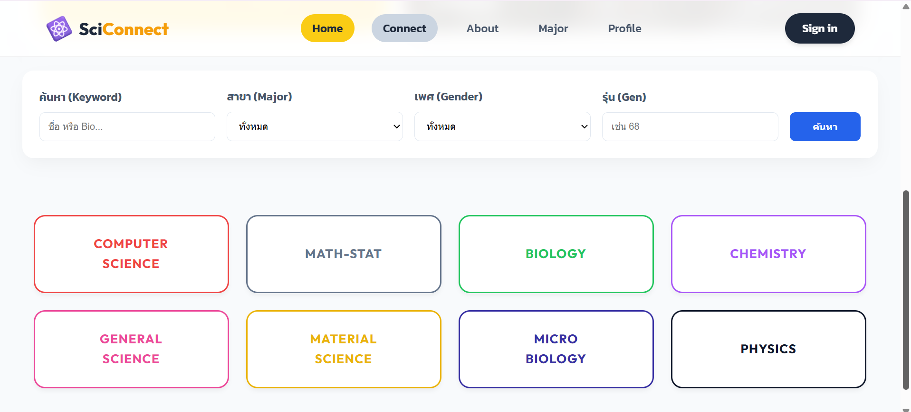
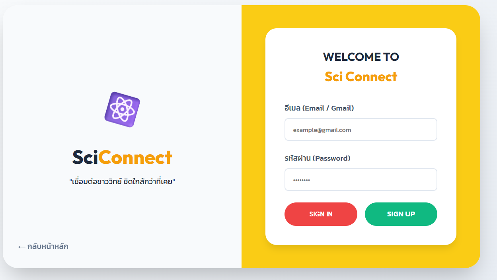
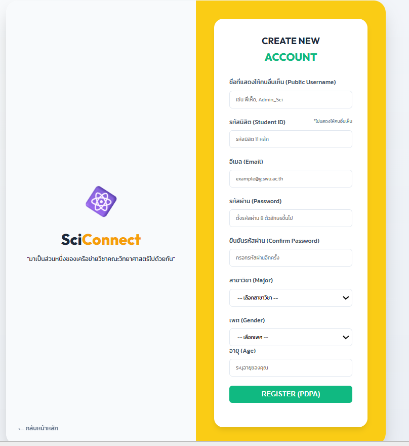
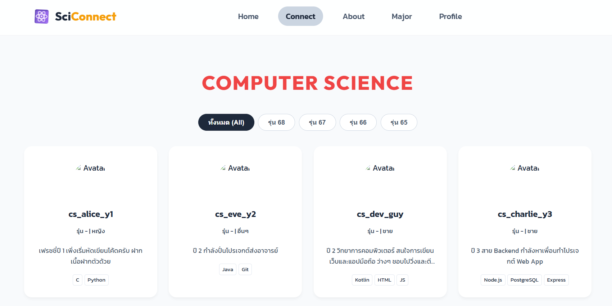
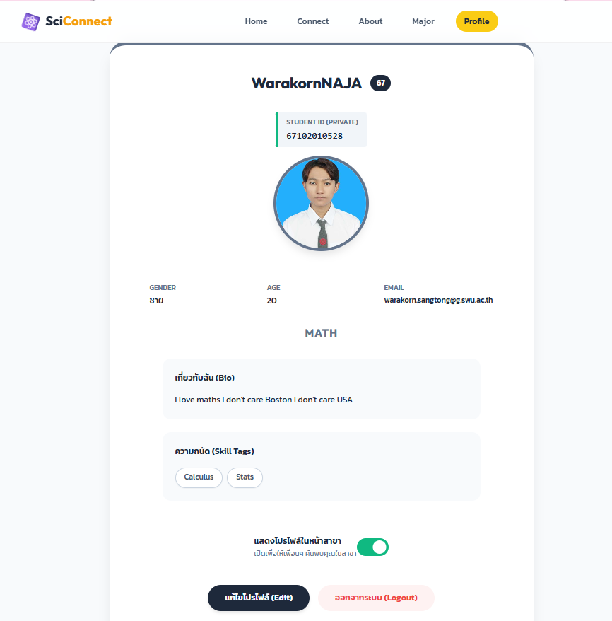

รายชื่อสมาชิก   
1.สิรภพ บุญโกสุมภ์ 67102010175  
2.พณพัฒน์ เขื่อนข่ายแก้ว 67102010522  
3.วรากร สังข์ทอง 67102010528  

# ข้อมูลเดิมจาก phase 1 and 2

# Phase 2

# sciconnect
ที่มาของปัญหาและความสำคัญ
ในปัจจุบัน นิสิตภายในคณะมีการเรียนและทำกิจกรรมแยกตามสาขาเป็นส่วนใหญ่ ทำให้นิสิตแต่ละสาขาไม่ค่อยมีโอกาสได้ทำความรู้จักหรือแลกเปลี่ยนความรู้กับนิสิตจากสาขาอื่น ส่งผลให้การสร้างความสัมพันธ์และเครือข่ายภายในคณะยังมีข้อจำกัด อีกทั้งการจัดเก็บข้อมูลรายชื่อนิสิตในรูปแบบเดิมยังขาดความเป็นระเบียบ ไม่มีแหล่งข้อมูลกลางที่รวบรวมรายชื่อนิสิตจากทุกสาขาและทุกรุ่นไว้อย่างชัดเจน  

ปัญหาดังกล่าวทำให้การค้นหาข้อมูล การติดต่อสื่อสาร และการทำความรู้จักนิสิตต่างสาขาเป็นไปได้ยาก ดังนั้นการพัฒนาระบบจัดเก็บและแสดงรายชื่อนิสิตในคณะจึงมีความสำคัญ เนื่องจากจะช่วยรวบรวมข้อมูลนิสิตไว้ในที่เดียวอย่างเป็นระบบ ทำให้นิสิตสามารถเข้าถึงข้อมูลและทำความรู้จักกันได้ง่ายขึ้น ช่วยส่งเสริมความสัมพันธ์ระหว่างนิสิตต่างสาขา และสร้างเครือข่ายภายในคณะให้เกิดความต่อเนื่องและยั่งยืน  

# จุดประสงค์ของโครงการ (แก้ปัญหาอะไร)  
1.เพื่อแก้ปัญหานิสิตแต่ละสาขาไม่ค่อยมีโอกาสได้ทำความรู้จักและติดต่อกัน  
2.เพื่อสร้างระบบที่รวบรวมข้อมูลรายชื่อนิสิตจากทุกสาขาและทุกรุ่นไว้ในที่เดียว  
3.เพื่ออำนวยความสะดวกในการค้นหาและทำความรู้จักนิสิตต่างสาขาและต่างรุ่น  
4.เพื่อส่งเสริมการสร้างความสัมพันธ์และการแลกเปลี่ยนความรู้ระหว่างนิสิตภายในคณะ  
# ประโยชน์ที่คาดว่าจะได้รับ  
1.นิสิตสามารถทำความรู้จักเพื่อนต่างสาขาได้ง่ายและมากขึ้น  
2.ช่วยสร้างเครือข่ายความสัมพันธ์ภายในคณะ และเพิ่มโอกาสในการทำกิจกรรมหรือทำงานร่วมกัน  
3.ทำให้นิสิตสามารถติดต่อหรือขอคำแนะนำจากนิสิตในสาขาอื่นได้สะดวกขึ้น  
4.คณะมีฐานข้อมูลรายชื่อนิสิตที่เป็นระเบียบและสามารถนำไปใช้งานต่อได้  
5.ระบบสามารถนำไปพัฒนาต่อยอดฟีเจอร์อื่น ๆ ในอนาคตได้  
# ขอบเขตของ project   
1.ผู้ใช้สามารถเข้าสู่ระบบโดยใช้เลขนิสิตได้  
2.ผู้ใช้สามารถเพิ่มรูปและข้อมูลของตัวเองลงไปได้  
3.ผู้ใช้สามารถดูข้อมูลที่ผู้อื่นได้  
4.ผู้ใช้สามารถแก้ไขข้อมูลของตัวเองได้ตลอดเวลา  
5.ผู้ใช้สามารถกดแสดงข้อมูลหรือกดไม่แสดงข้อมูลของตนเองได้  
6.มีการแยกสาขาและชั้นปีชัดเจน  

# Function and non-Functional requirement  
## Function Requirement  
1.ให้ User สามารถ Login/Sign Up ได้  
2.ก่อนใช้งานต้องถามความยินยอม PDPA จากผู้ใช้งาน หากไม่ยินยอม จะไม่สามารถเข้าใช้งานได้  
3.ต้องให้รูปโปรไฟล์สามารถใส่ได้มากกว่า 1 รูป  
4.ต้องการให้มีสีกรอบโปรไฟล์บ่งบอกถึงสาขาวิชาของ User นั้นๆ  
5.นิสิตที่อยู่ระหว่างการศึกษา จะมีเลขชั้นปี 1,2,3,4 อยู่ที่มุมโปรไฟล์  
6.นิสิตที่เป็นศิษย์เก่า จะมีเลขรหัส 2 ตัวหน้าที่แสดงถึงปีการศึกษา เช่น 62 63 ที่มุมโปรไฟล์  
7.นิสิตที่ลาออก/ไม่ได้อยู่ระหว่างศึกษาปัจจุบัน จะแสดงเป็น ex ที่มุมโปรไฟล์  
8.ถ้า User ทำการ Login แต่ไม่อยากเปิดเผยโปรไฟล์ ต้องการให้ขึ้นสาขาวิชาของ User นั้นๆ  
9.หน้าแรกที่เป็นหน้าแนะนำ User อื่นๆ อยากให้ขึ้นโปรไฟล์แบบ Random ไม่สนใจสาขาวิชา  
10.ในส่วนที่กรอกคำอธิบาย อยากให้มีการตรวจสอบคำที่ไม่เหมาะสม  
## non-Functional Requirement  
1.ต้องการให้ใช้งานง่าย เหมาะสำหรับคนทุกสาขาวิชา  
2.เน้นโทนสีที่มีความสวยงาม สบายตา  

# ข้อมูลเพิ่มเติม
## Function Requirement 
1.ให้ User สามารถ Login/Sign Up ได้  
2.ก่อนใช้งานต้องถามความยินยอม PDPA จากผู้ใช้งาน หากไม่ยินยอม จะไม่สามารถเข้าใช้งานได้  
4.ต้องการให้มีสีกรอบโปรไฟล์บ่งบอกถึงสาขาวิชาของ User นั้นๆ  
5.นิสิตที่อยู่ระหว่างการศึกษา จะมีเลขชั้นปี 1,2,3,4 อยู่ที่มุมโปรไฟล์  
6.นิสิตที่เป็นศิษย์เก่า จะมีเลขรหัส 2 ตัวหน้าที่แสดงถึงปีการศึกษา เช่น 62 63 ที่มุมโปรไฟล์  
8.ถ้า User ทำการ Login แต่ไม่อยากเปิดเผยโปรไฟล์ ต้องการให้ขึ้นสาขาวิชาของ User นั้นๆ  
(ตัดข้อ 3,7,9,10)
## (New) Function Requirement  
1.เพิ่มระบบ Skill Tags เพื่อให้ผู้ใช้กำหนดความถนัดเป็นคำสั้นๆ ช่วยให้ค้นหาได้ง่ายและแม่นยำขึ้น
2.เพิ่มระบบ Social Media Links ในหน้าโปรไฟล์ เพื่อให้นิสิตสามารถกดปุ่มติดต่อกันผ่าน Line หรือ IG ได้ทันที (ตามที่ได้รับ Feedback จากการสัมภาษณ์)
3.เพิ่มระบบ Filter & Search ให้สามารถค้นหาสมาชิกจาก Skill, ชั้นปี และสาขาวิชาได้

## non-Functional Requirement  
1.ต้องการให้ใช้งานง่าย เหมาะสำหรับคนทุกสาขาวิชา  
2.เน้นโทนสีที่มีความสวยงาม สบายตา 
## (New) non-Functional Requirement  
1.เพิ่ม Responsive Web Design: หน้าเว็บไซต์ต้องแสดงผลได้พอดีกับหน้าจอโทรศัพท์มือถือ

# Use case diagram

# Architecture Diagram (MVC)  

 
# อธิบายกระบวนการทำงาน โดยใช้ process, methods, and tools อย่างไร (ข้อมูลจาก phase 1)
## 1. Process  
ระบบถูกพัฒนาต่อยอดจากฟังก์ชัน Category เดิม โดยปรับเปลี่ยนวัตถุประสงค์จากการเก็บข้อมูลทั่วไป มาเป็นระบบ จัดเก็บและแสดงข้อมูลสมาชิก อย่างเป็นโครงสร้างชัดเจน ซึ่งกระบวนการทำงานหลักมีดังนี้  
กำหนด Category ให้แทน สาขา / ปีการศึกษา (รุ่น)  
ผู้ดูแลหรือสมาชิกสามารถเลือก Category ที่ต้องการ  
เพิ่มข้อมูลสมาชิกภายใน Category นั้น ๆ  
ระบบจัดเก็บข้อมูลสมาชิกอย่างเป็นระเบียบในฐานข้อมูล  
แสดงผลข้อมูลสมาชิกตามสาขาและรุ่น  
ผู้ใช้งานสามารถเข้าดู ค้นหา และทำความรู้จักสมาชิกได้อย่างสะดวก  
## 2. Methods 
ระบบใช้แนวคิดการออกแบบแบบมีโครงสร้าง เพื่อให้ข้อมูลมีความเป็นระเบียบและใช้งานได้ในระยะยาว โดยมีวิธีการดังนี้  
ใช้แนวคิด Category-based Organization  
 > ใช้ Category แทนสาขาและปีการศึกษา เพื่อแยกกลุ่มสมาชิกอย่างชัดเจน  
ออกแบบข้อมูลสมาชิกแบบ Profile-based  
 โดยข้อมูลของสมาชิกแต่ละคนประกอบด้วย  
ชื่อ–นามสกุล หรือชื่อเล่น  
รูปภาพโปรไฟล์  
ข้อมูลแนะนำตัวสั้น ๆ (ความถนัด / ความสนใจ)  
ข้อมูลการติดต่อ  
ใช้แนวคิด User-centered Design  
 เพื่อให้ผู้ใช้งานรุ่นน้องสามารถค้นหา ทำความรู้จัก และติดต่อรุ่นพี่ได้ง่าย  
## 3. Tools 
เครื่องมือพัฒนาเว็บไซต์  
HTML / CSS / JavaScript สำหรับแสดงผล  
PHP สำหรับจัดการข้อมูลฝั่งเซิร์ฟเวอร์  
ฐานข้อมูล  
phpMyAdminสำหรับจัดเก็บข้อมูล Category และข้อมูลสมาชิก  
เครื่องมือพัฒนา  
VS Code สำหรับเขียนและแก้ไขโค้ด  
XAMPP สำหรับจำลองเซิร์ฟเวอร์และฐานข้อมูล  

# Website Screenshot
Figma - SciConnect (Draft)

# Process, Methods, and Tools
## 1.การติดตามสถานะของโครงการ (Project Status Tracking)
วิธีการ  
โครงการมีการแบ่งงานออกเป็นงานย่อย (Task) เช่น งานออกแบบ UI, งานพัฒนา Prototype และงานจัดทำเอกสาร โดยกำหนดสถานะของงานเพื่อให้เห็นความคืบหน้าอย่างชัดเจน ได้แก่ To Do, In Progress และ Done  
เครื่องมือที่ใช้  
GitHub Issues / GitHub Projects  
Google Sheet สำหรับติดตามงานด้านเอกสารและวิดีโอ  
## 2. ความบ่อยของการ Scrum / การประชุมทีม
วิธีการ  
มีการประชุมทีมแบบสั้น (Scrum Meeting) เพื่อรายงานความคืบหน้า ปัญหาที่พบ และแผนงานถัดไป  
ความถี่  
สัปดาห์ละ 1–2 ครั้ง  
หรือก่อนการส่งงานและปรับแก้ Prototype  
เครื่องมือที่ใช้  
Discord  
Instagram / LINE กลุ่ม สำหรับการนัดหมายและแจ้งเตือน  
## 3. การตั้งชื่อ Branch
วิธีการ  
ใช้การแยก Branch ตามประเภทของงาน เพื่อป้องกันปัญหาการชนกันของโค้ด และช่วยให้การพัฒนาเป็นระบบ  
รูปแบบการตั้งชื่อ Branch  
main – Branch หลักของโครงการ  
feature/ui-design – งานออกแบบ UI  
feature/prototype – งานพัฒนา Prototype  
fix/bug-name – แก้ไขข้อผิดพลาด  
เครื่องมือที่ใช้  
GitHub  
## 4. การกำหนด Format ของ Commit Message
วิธีการ  
กำหนดรูปแบบ Commit Message ให้สื่อความหมายชัดเจน เพื่อให้สามารถตรวจสอบประวัติการพัฒนาได้ง่าย  
รูปแบบที่ใช้  
feat: สำหรับเพิ่มฟังก์ชันใหม่  
fix: สำหรับแก้ไขข้อผิดพลาด  
ui: สำหรับปรับปรุงส่วนติดต่อผู้ใช้  
docs: สำหรับแก้ไขเอกสาร  
ตัวอย่าง  
feat: add contact input form  
ui: improve homepage layout  
เครื่องมือที่ใช  
Git / GitHub  
## 5. การสื่อสารระหว่างการทำโครงการ
วิธีการ  
    ใช้การสื่อสารหลายช่องทางตามลักษณะของงาน เพื่อให้การทำงานมีประสิทธิภาพ  
ช่องทางการสื่อสาร  
Instagram / LINE กลุ่ม – ใช้สื่อสารทั่วไปและแจ้งความคืบหน้า  
Discord – ใช้ประชุมและสรุปงาน  
GitHub Issues – ใช้สื่อสารเกี่ยวกับปัญหาทางเทคนิคและโค้ด

# เขียนสรุปการประชุม Retrospective และ Link to Retrospective Youtube video
หัวข้อ :  Initial Design and prototype
สรุปประเด็นสำคัญ  
ปัญหา : เรื่องการทำงานยังไม่คุ้นกับขนาดงานจริง เรื่องเวลาไม่ตรงกัน การใช้งานโปรแกรมใหม่ๆทำให้ต้องมาศึกษาการใช้งานใหม่ด้วย และการต้องศึกษาอะไรที่ไม่ค่อยรู้ทำให้ต้องใช้เวลานานในการเรียนรู้ทำให้ทำงานไม่เป็นไปตตามที่วางแผนไว้  
ความต้องการ : ต้องการเวลาให้ตรงกันและการแบ่งหน้าที่ชัดเจน และหาเวลามาประชุมกันเรื่องเนื้อหางาน  
สรุป : จึงตัดสินใจให้มีการประชุมอาทิตละครั้ง เนื้อหาในการประชุมจะเป็นการอัพเดทงานที่ทำของแต่ละคน และปัญหาที่กำลังพบเจอในการทำงาน  
Interview Link : https://youtu.be/BmSIIbYLIM8

# Phase 3

# สิ่งที่ยังไม่เสร็จสมบูรณ์ เช่น bug, error
1.มีการเกิด bug ตรงช่องค้นหาที่ยังค้นหาได้ไม่สมบูรณ์
2.เมื่อผู้ใช้ sign-up ครั้งแรก จะมีการเกิด bug ที่ Age เพศ
3.layout ของ CSS ยังไม่สมบูรณ์

# Website screenshot

# สิ่งเปลี่ยนแปลงจาก รายงาน phase 1 and 2 และ เหดุผลที่เปลี่ยน
old : นิสิตที่อยู่ระหว่างการศึกษา จะมีเลขชั้นปี 1,2,3,4 อยู่ที่มุมโปรไฟล์  
new : นิสิตที่อยู่ระหว่างการศึกษา จะมีเลขรหัสนิสิต 2 ตัวแรก ซึ่งแสดงถึงปีการศึกษาที่เข้าเรียนแสดงที่โปรไฟล์ เช่น 68 67 66 65 เนื่องจากความสะดวกที่ไม่ต้องมาเปลี่ยนข้อมูลผู้ใช้เมื่อผู้ใช้เลื่อนปีการศึกษา

old : เพิ่ม Responsive Web Design: หน้าเว็บไซต์ต้องแสดงผลได้พอดีกับหน้าจอโทรศัพท์มือถือ
new : ตัด Responsive Web Design เนื่องจากมีความเกินขอบเขตของผู้พัฒนา ซึ่งอาจจะมีมีการพัฒนาในอนาคต

# อธิบายการทำงานของ Program

**Method ที่ใช้งานในระบบทั้งหมด:**
- **GET Methods :**
  1. `GET /` - ส่งหน้า `home.html` (Static file) กลับไปยังผู้ใช้
  2. `GET /api/users` - ดึงข้อมูลผู้ใช้งานที่ตั้งค่าเป็นสาธารณะทั้งหมด
  3. `GET /api/users/search` - ค้นหาและคัดกรองผู้ใช้งานตามเงื่อนไข 
  4. `GET /api/users/:id` - ดึงข้อมูลรายละเอียดของผู้ใช้แต่ละบุคคลด้วย ID
- **POST Methods :**
  1. `POST /api/users` - เพิ่มข้อมูลผู้ใช้ใหม่ 
  2. `POST /api/users/login` - ตรวจสอบการเข้าสู่ระบบ 
- **Method อื่นๆ :**
  1. `PUT /api/users/:id` - อัปเดตข้อมูลส่วนตัว 
  2. `PATCH /api/users/:id/visibility` - อัปเดตสถานะการแสดงผลโปรไฟล์ 

**การใช้งาน Template:**
- ระบบไม่ได้ใช้ Server-side Template Engine แต่ใช้วิธี **Static HTML** ร่วมกับ **Vanilla JavaScript** 
- ฝั่ง Frontend จะทำการเรียกใช้งาน API และนำข้อมูล JSON ล่าสุดมาสร้าง Element ผ่าน JavaScript ทันที

**การเรียก API (API Integration):**
- **Internal API:** มีการเรียกใช้ HTTP Request ไปยัง Backend RESTful API ของตัวเอง 
- **External API:** ระบบมีการดึง API ภายนอกเพื่อนำมาสร้างรูปภาพโปรไฟล์เริ่มต้นแบบอัตโนมัติ สำหรับผู้ที่ไม่ได้อัปโหลดภาพ โดยแสดงเป็นภาพตัวอักษรแรกของชื่อ

**การคำนวณและการแสดง Graph:**
- **การคำนวณชั้นปี/รุ่น (Generation Extraction):** ระบบจะคำนวณด้วยการตัดข้อความ 2 ตัวอักษรแรกจากสายอักขระ `student_id` ทั้งหน้าบ้าน (`substring(0, 2)`) และฝั่งฐานข้อมูลด้วย SQL Function (`LEFT(student_id, 2) AS generation`)
- **การคำนวณลดขนาดภาพ (Image Resizing Engine):** หน้าบ้านมีการคำนวณอัตราส่วนภาพด้วย Canvas 2D API เพื่อคงอัตราส่วนรูปให้ถูกต้อง แต่จำกัดความละเอียดภาพไม่ให้เกิน 500x500px ก่อนนำไปเข้ารหัสเป็น Base64 String 

# Test Coverage Report

รายงานการทดสอบ Unit Testing โครงสร้างจัดเก็บข้อมูลและ Data Structure (เป้าหมาย 80% Statement Coverage)

หมวดการวัด	ค่า Coverage
Statements	86.48%
Branches	81.25%
Functions	88.88%
Lines	       87.09%

# Process, Methods, and Tools ที่เพิ่มเติมจาก Phase 1 และ 2

## 1. การบริหาร Project

ปรับจากการคุยงานในแชท มาใช้ Kanban Board เพื่อจัดลำดับงาน ตรวจสอบ Backlog และดูสถานะงานแบบชัดเจน
ใช้ GitHub Projects / Issues Board เป็นเครื่องมือหลักในการจัดการ Task และความคืบหน้า

## 2. การตรวจสอบระบบก่อนพัฒนา (Monitor Build)

กำหนดขั้นตอน Sanity Check ก่อนทำงานทุกครั้ง โดยรัน node index.js เพื่อตรวจสอบการเชื่อมต่อฐานข้อมูลและดู log บน terminal
ใช้ VS Code Terminal และ Nodemon (ถ้ามี) เพื่อช่วยตรวจจับ Error แบบ Real-time

## 3. การจัดการบั๊กอย่างเป็นระบบ

ใช้กระบวนการ Reproduce → วิเคราะห์สาเหตุ → แก้เฉพาะจุด เพื่อลดผลกระทบต่อโค้ดส่วนอื่น
บันทึกบั๊กผ่าน GitHub Issues พร้อมแนบ Stack Trace และเชื่อม Commit กับ Issue เพื่อให้ตรวจสอบย้อนหลังได้ง่าย
